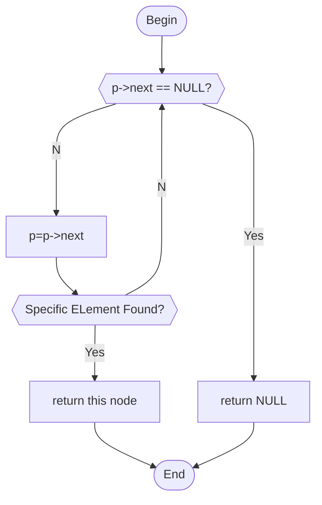
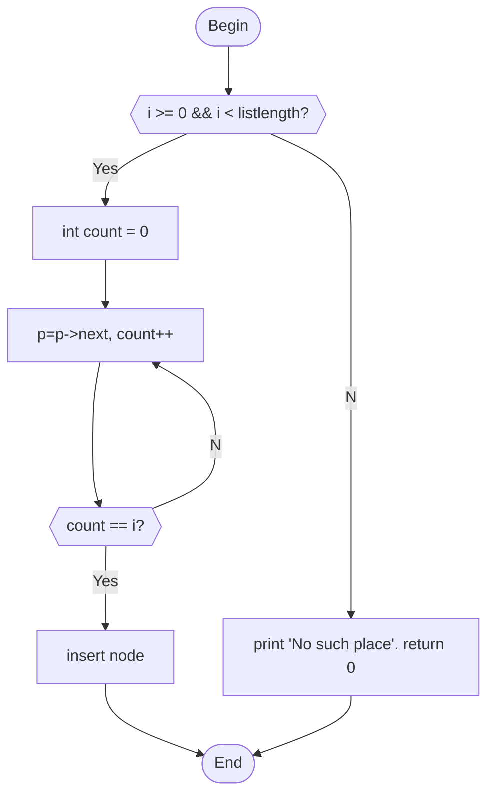
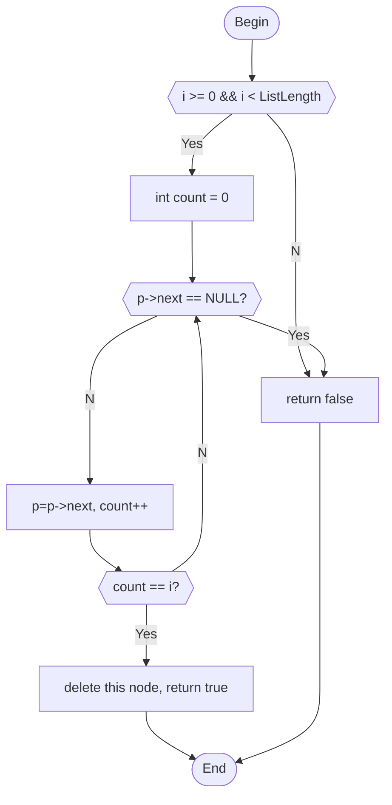

# 流程图

[TOC]

## 线性表的链式实现

### 链表中查找给定元素：

```mermaid
graph TD
A([Begin])
C{{p->next == NULL?}}
D{{Specific ELement Found?}}
E[return this node]
F[p=p->next]
G[return NULL]
H([End])
A  --> C --No--> F --> D --Yes--> E --> H
C --Yes--> G --> H
D --No--> C 
```

### 链表中插入下一个结点

```mermaid
graph TD
A([Begin])
W[int count = 0]
C{{i >= 0 && i < listlength?}}
D{{count == i?}}
E[insert node]
F[p=p->next, count++]
G[print 'No such place'. return 0]
H([End])
A --> C --Yes-->W --> F --> D --Yes--> E --> H
C --No--> G --> H
D --No--> F 
```

### 链表中删除一个结点

```mermaid
graph TD
A([Begin])
M{{i >= 0 && i < ListLength}}
W[int count = 0]
C{{p->next == NULL?}}
D{{count == i?}}
E[delete this node, return true]
F[p=p->next, count++]
G[return false]
H([End])
A --> M --Yes-->W--> C--No--> F --> D --Yes--> E --> H
M --No--> G
C --Yes--> G --> H
D --No--> C 
```

